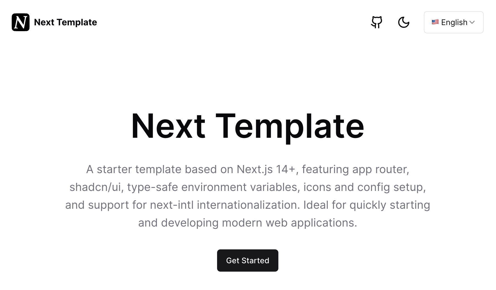

<a href="https://next-template-fast.vercel.app/">

</a>
<p align="center">
  <a href="./README.md">English</a> | 
  <a href="./README_zh.md">简体中文</a> 
</p>

<p align="center">
  <a href="#-介绍"><strong>介绍</strong></a> ·
  <a href="#-功能"><strong>功能</strong></a> ·
  <a href="#-部署"><strong>部署</strong></a> ·
  <a href="#-贡献"><strong>贡献</strong></a> ·
  <a href="#%EF%B8%8F-支持"><strong>支持</strong></a>
</p>

## 📖 介绍

基于 Next.js 14+ 的启动模板，包括 app router、shadcn/ui、类型安全的环境变量、图标和配置设置，next-intl 国际化的支持。非常适合快速开始和开发现代网络应用程序。

## 🎉 功能

- Next.js 14（app router）
- React 18
- Typescript
- TailwindCSS
- Shadcn/ui
- next-intl - Next.js 的国际化
- Zod - 模式验证库
- Prettier - 代码格式化工具
- Eslint - 代码检查工具
- Husky & Lint Staged
- Icons - 来自 Lucide
- 暗黑模式 - 使用 next-themes
- 网站地图 & robots.txt - 使用 next-sitemap
- T3-env - 管理你的环境变量
- 完美的 Lighthouse 评分

## 🚀 部署

您可以使用下面的按钮将此模板部署到 Vercel：

[](https://vercel.com/new/clone?repository-url=https%3A%2F%2Fgithub.com%2Fzjy365%2Fnext-template)

您也可以使用以下命令在本地克隆并创建此仓库：

```bash
npx create-next-app -e https://github.com/zjy365/next-template my-project-name
```

1. 安装依赖

```bash
pnpm i
```

2. 设置环境变量
   创建 .env 文件并从 .env.example 文件设置环境变量。

3. 您可以使用以下命令启动服务器：

```bash
pnpm dev
```

4. 打开 http://localhost:3000/ 查看此应用。

## 🤝 贡献

要贡献，请遵循以下步骤：

Fork 仓库。
创建一个新分支。
进行更改，并提交它们。
将更改推送到 forked 仓库。
创建一个拉取请求。

## ❤️ 支持

如果您喜欢这个项目，我会很感激如果您留下一个星星。🌟😊
